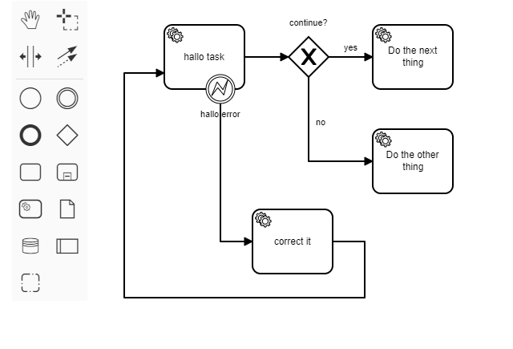

# BPMN Modeling in Larger Steps

Example of a modeler plugin to add some connected elements by dragging them as a single symbol from the palette.

A plugin build for the Camunda Modeler.

## Use case

With this plugin you can a drag bunch of connected and preconfigured BPMN elements (Tasks, Gateway, Attached Bounday Event and Sequence Flows) and drop it into the canvas.

It maybe useful if you identify a pattern, here for predefined error resolution, and want to use it in all your models without dragging each element again and connecting them by hand.



## Learning and Examples

As I've only a low experience programming javascript with node.js, these resources helped me most to get on the right track:

* https://www.youtube.com/watch?v=sav98y4EFzE
* https://github.com/camunda/camunda-modeler-plugins/tree/master/bpmn-js-plugin-example
* https://github.com/nikku/camunda-modeler-plugins-talk-2019

## How is it build?

The project started from the [Camunda Modeler Plugin Example](https://github.com/camunda/camunda-modeler-plugin-example) and uses the [bpmn-js-example-custom-controls](https://github.com/bpmn-io/bpmn-js-example-custom-controls) to see how you can add a new element to the palette.

To add configurations to the element you have to know, that the `businessObject` of a shape represents the content that you usually configure with the property panel. (https://github.com/bpmn-io/bpmn-js-examples/tree/master/bpmn-properties#writing-bpmn-properties)

### Service tasks

With this snippet you can drag a predefined Service Task into the canvas:

```javascript
function serviceTaskConfiguration(businessObject, name, delegateExpression) {
  businessObject.name = name;
  businessObject.delegateExpression = delegateExpression;
  businessObject.asyncBefore = true;
  return businessObject;
}

const invokeMyServicetaskShape = elementFactory.createShape({ type: 'bpmn:ServiceTask', x:0, y:0 });
serviceTaskConfiguration(invokeMyServicetaskShape.businessObject, 'Invoke my service', '${logger}');
```

If you want to add the Retry Time Cycle, you have to create the extension element before and place the `FaildJobRetryTimeCycle` element inside:

```javascript
var failedJobRetryTmeCycle = bpmnFactory.create('camunda:FailedJobRetryTimeCycle', {
  body: 'R3/PT10S'
});

var r3pt10sExtensionElement = bpmnFactory.create('bpmn:ExtensionElements', {
  values: [ failedJobRetryTmeCycle ]
});
invokeMyServicetaskShape.businessObject.extensionElements = r3pt10sExtensionElement;
```

Some example use `moddle` to create model elements, but if you use `bpmnFactory` instead, they will get unique IDs.

### Sequence Flows

To connect two elements like this with Sequence Flows, you have to create them with their waypoints as in this example:

```javascript
function createConnection(sourceShape, targetShape, waypoints) {
  return elementFactory.createConnection({type: 'bpmn:SequenceFlow', 
    source: sourceShape, 
    target: targetShape, 
    waypoints: waypoints
  });
}

const sequenceFlowExclusiveNext = 
  createConnection(exclusiveGatewayShape, nextThingServiceTaskShape, [{x:200, y:40}, {x:250, y:40}]);
sequenceFlowExclusiveNext.businessObject.name = 'yes';
```

If the Sequence Flow needs a Condition Expression, just add it to the `businessObject`:

```javascript
sequenceFlowExclusiveNext.businessObject.conditionExpression = 
   bpmnFactory.create('bpmn:FormalExpression', {body: '${continue}'});
```

### Attached boundary error event

To attach an Error Boundary Event, you have to create the error first:

```javascript
var error = bpmnFactory.create('bpmn:Error', {errorCode: 'abc', name: 'myErrorName'});
```

This error has to be attached to root element of the XML:
```javascript
var definitions = bpmnJs.getDefinitions();
definitions.get('rootElements').push(error);
```

Then you can create the Error Event Definition and attach it to the shape (the drawn picture on the canvas):

```javascript
var erroreventDefinition = bpmnFactory.create('bpmn:ErrorEventDefinition', {
  errorCodeVariable: 'errorCode',
  errorMessageVariable: 'errorMessage',
  errorRef: error
});

const erroreventShape = elementFactory.createShape({ type: 'bpmn:BoundaryEvent', x:50, y:62 });
erroreventShape.businessObject.name = 'hallo error';
erroreventShape.businessObject.eventDefinitions = [erroreventDefinition];
```

The last step is to attach the shape to an existing task:
```javascript
erroreventShape.businessObject.attachedToRef = invokeMyServicetaskShape.businessObject;
erroreventShape.host = invokeMyServicetaskShape;

erroreventDefinition.$parent = erroreventShape.businessObject;
```

### Creating all the elements

To create this set of elements, you have to add all your shapes and Sequence Flows:

```javascript
create.start(event, [
  invokeMyServicetaskShape, 
  exclusiveGatewayShape, 
  nextThingServiceTaskShape, 
  sequenceFlowExclusiveNext
]);
```