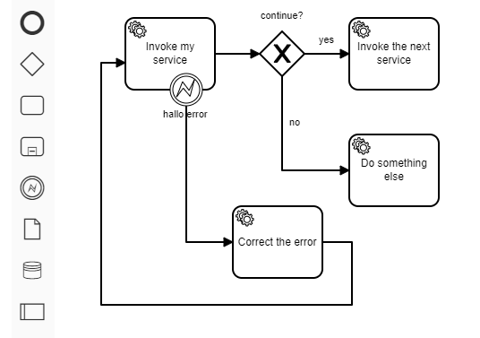

# BPMN Modeling in Larger Steps

Example of a modeler plugin to add some connected elements by dragging them as a single symbol from the palette.

A plugin build for the Camunda Modeler.

## Use case

With this plugin you can a bunch of connected and preconfigured BPMN elements (Tasks, Gateway, Attached Bounday Event and Sequence Flows) and drop it into the canvas.

It maybe useful if you identify a pattern, here for predefined error resolution, and want to use it in all your models without dragging each element again and connecting them by hand.



## Learning and Examples

https://www.youtube.com/watch?v=sav98y4EFzE

https://github.com/camunda/camunda-modeler-plugins/tree/master/bpmn-js-plugin-example

https://github.com/nikku/camunda-modeler-plugins-talk-2019

## How is it build?

The project started from the Camunda Modeler Plugin Example https://github.com/camunda/camunda-modeler-plugin-example and uses the bpmn-js-example-custom-controls https://github.com/bpmn-io/bpmn-js-example-custom-controls to see how you can add a new element to the palette.

To add configurations to the element you have to know, that the `businessObject` https://github.com/bpmn-io/bpmn-js-examples/tree/master/bpmn-properties#writing-bpmn-properties of a shape represents the content that you usually configure with the property panel.

With this snippet you can drag a predefined service task into the canvas:

```javascript
function serviceTaskConfiguration(businessObject, name, delegateExpression) {
  businessObject.name = name;
  businessObject.delegateExpression = delegateExpression;
  businessObject.asyncBefore = true;
  return businessObject;
}

const helloServicetaskShape = elementFactory.createShape({ type: 'bpmn:ServiceTask', x:0, y:0 });
serviceTaskConfiguration(helloServicetaskShape.businessObject, 'hallo task pal', '${logger}');
```

If you want to add the Retry Time Cycle, you have to create the extension element before and place the FaildJobRetryTimeCycle element inside:

```javascript
var failedJobRetryTmeCycle = moddle.create('camunda:FailedJobRetryTimeCycle', {
  body: 'R3/PT10S'
});

var r3pt10sExtensionElement = moddle.create('bpmn:ExtensionElements', {
  values: [ failedJobRetryTmeCycle ]
});
helloServicetaskShape.businessObject.extensionElements = r3pt10sExtensionElement;
```

To connect more elements like this with Sequence Flows, you have to create them with their waypoints as in this example:

```javascript
function createConnection(sourceShape, targetShape, waypoints) {
  return elementFactory.createConnection({type: 'bpmn:SequenceFlow', 
    source: sourceShape, 
    target: targetShape, 
    waypoints: waypoints
  });
}

const sequenceFlowExclusiveNext = 
  createConnection(exclusiveGatewayShape, nextThingServiceTaskShape, [{x:200, y:40}, {x:250, y:40}]);
sequenceFlowExclusiveNext.businessObject.name = 'yes';
```

If the Sequence Flow needs a Condition Expression, just add it to the `businessObject`:

```javascript
sequenceFlowExclusiveNext.businessObject.conditionExpression = 
   moddle.create('bpmn:FormalExpression', {body: '${continue}'});
```

To create this set of elements, you have to add all your shapes and Sequence Flows:

```javascript
create.start(event, [helloServicetaskShape, 
  exclusiveGatewayShape, 
  nextThingServiceTaskShape, 
  sequenceFlowExclusiveNext
]);
```